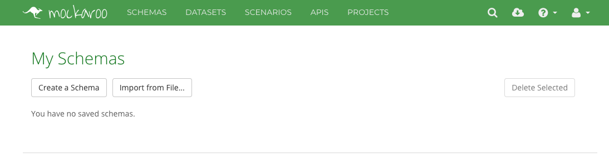
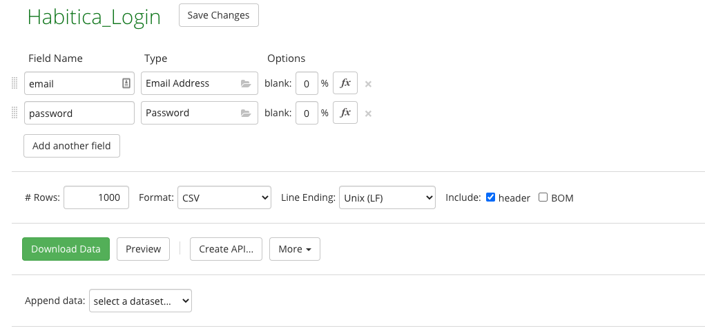
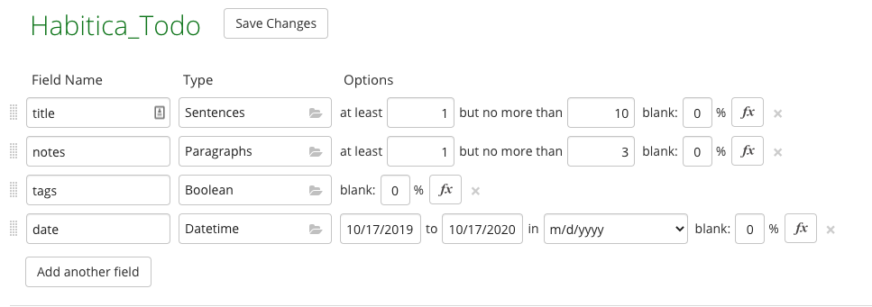
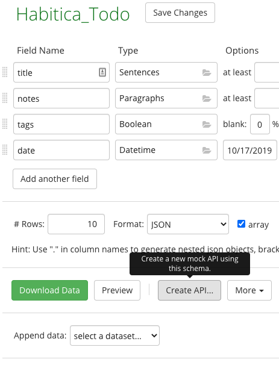
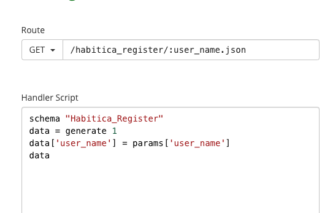
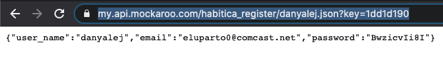
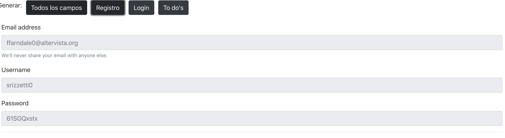
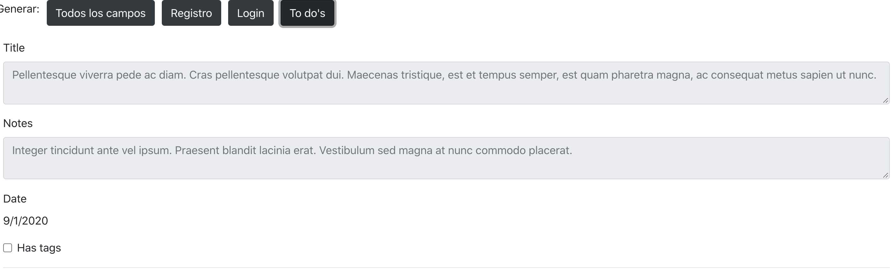

# Taller 7: Generación automática de datos con Mockaroo, Podam y Faker JS

---

## Table of Contents

- [Taller 7: Generación automática de datos con Mockaroo, Podam y Faker JS](#taller-7-generación-automática-de-datos-con-mockaroo-podam-y-faker-js)
  - [Table of Contents](#table-of-contents)
  - [Introducción](#introducción)
  - [Aplicación](#aplicación)
  - [Solución](#solución)
  - [Mockaroo](#mockaroo)
    - [Generación de Schemas](#generación-de-schemas)
    - [Creación de API](#creación-de-api)
    - [Interfaz](#interfaz)
  - [Podam](#podam)
    - [Introducción](#introducción-1)
    - [Instalación de Podam](#instalación-de-podam)
    - [Creación de las clases a probar](#creación-de-las-clases-a-probar)
    - [Definición de reglas de negocio](#definición-de-reglas-de-negocio)
    - [Crear pruebas con Podam](#crear-pruebas-con-podam)
    - [Tu turno](#tu-turno)

---

## Introducción

Se hará una descripción de cada una de las herramientas y un demo de su funcionamiento el cuál será explicado en la wiki del repositorio.
En este caso será necesario:

1. Crear un demo de una API Rest para registro de cuentas nuevas con Mockaroo
2. Crear 3 distintos esquemas para posibles usos dentro de las aplicaciones Habitica y MyExpenses.
3. Generación de esquemas y datos automáticos para el uso en la aplicación móvil de Habitica con Podam.
4. Replicar los mismos esquemas creados con Mockaroo en la herramienta Facker.js.

## Aplicación

1. Partiendo de la base del taller 5, es necesario que se prueben los formularios de registro de la aplicación Habitica, haciendo uso de datos generados automáticamente por la aplicación Faker.js.

2. Mediante el uso de Podam se probarán las mismas funcionalidades en las aplicaciones móviles Habitica y MyExpenses. Se probara el login y registro de Habitica, y los input fields de MyExpenses.

## Solución

La solución del taller se puede encontrar en esta link de forma organizada:<br />

https://docs.google.com/document/d/1I5PqdPoc-RrhYmZhOUW_dnCDraG26U9knTdegJDDcaQ/edit?usp=sharing

Tambien fue incluida aca debajo.

## Mockaroo

Mockaroo es un a plataforma que permite crear datos de prueba. La herramienta permite crear un API a la cuál se pueden hacer requests reales que permitirán identificar problemas reales de la aplicación lo que permitirá mejorar la experiencia de usuario y la creación de la UI.
Mockaroo permite mandar grandes cantidades de información con variedad en poco tiempo y simula las condiciones a las que la aplicación se enfrentaría en producción con cientos de usuarios haciendo uso de la aplicación y llenando la base de datos con información distinta.
Tambien es posible hacer uso de herramientas no programáticas y descargar la información en formato SQL o CSV.

### Generación de Schemas

Para crear los Schemas, es decir la plantilla con la que se crearan los datos. <br />


Esquema para registro de Habitica: <br />

Como se puede observar, la información se puede generar con campos vacíos basados en un porcentaje. Esto resulta útil al momento de probar formularios y sus verificaciones de campos vacíos.

Login Habitica: <br />

Esquema para creación de Todos: <br />
 <br />
Basado en: <br />


### Creación de API

Para la creación de la API Rest, una vez creados los esquemas dentro de la herramienta mockaroo es necesario dirigirse al esquema el cuál se desea utilizar y crear la API. <br />

Nota: Es importante que al momento de guardar el esquema se elija el formato en el cuál se desea que la API responda y cuantos datos debe generar.
Habitica_Todo
GET:<br />
https://my.api.mockaroo.com/habitica_todo.json?key=1dd1d190)
POST: <br />
https://my.api.mockaroo.com/habitica_todo.json?key=1dd1d190&__method=POST
GET (:id):<br />
https://my.api.mockaroo.com/habitica_todo/123.json?key=1dd1d190
Habitica_Register<br />
GET:<br />
[](https://my.api.mockaroo.com/habitica_register.json?key=1dd1d190)
GET (:id):<br />
Para simular de manera correcta la obtención de datos fue necesario agregar lo si quiente a mockaroo de manera que se devolviese el mismo usuario que se pidio aunque el resto de campos vuelven a hacer aleatorios.

Si intentamos obtener el usuario DanyAlej, obtenemos este mismo usuario: <br />
https://my.api.mockaroo.com/habitica_register/danyalej.json?key=1dd1d190 <br />

POST: <br />
https://my.api.mockaroo.com/habitica_register.json?key=1dd1d190&__method=POST
Habitaca_Login:
GET:<br />
https://my.api.mockaroo.com/habitica_login.json?key=1dd1d190
POST:<br />
https://my.api.mockaroo.com/habitica_login.json?key=1dd1d190&__method=POST
GET (:email):<br />
https://my.api.mockaroo.com/habitica_login/dabenavides.json?key=1dd1d190

### Interfaz

En este video se puede encontrar el funcionamiento de la interfaz:
https://www.loom.com/share/b6e1f560b6a6460fb270be0b64424e4c <br />
La interfaz interactúa con las diferentes APIs creadas, en este caso se presentan los 3 esquemas usados.
<br />
<br />


## Podam

### Introducción

Podam es una herramienta de generación de datos para objetos planos de Java. Algunas de sus principales características es que él automáticamente genera datos para los atributos de la clase, pero, así mismo, se le pueden manipular las estrategias de generación de datos, ignorar ciertos campos y te permite crear tus propias fábricas para cuando éste no puede generar los datos por sí solo.

### Instalación de Podam

Primero, comenzamos por crear un proyecto Maven. **Maven** es un herramienta que nos facilita la creación y el manejo de proyectos de Java, por lo que nos servirá para correr los tests y crear las clases de manera sencilla. Así, podremos concentrarnos en Podam.

### Creación de las clases a probar

Para este taller, crearemos una clase que simula los datos ingresados por un usuario para registrarse en una página web. En este orden de ideas, tendremos los siguientes atributos:

```java
private String nombre;
private String username;
private String correo;
private int edad;
private String clave;
private String claveVerificada;
```

Así mismo, debemos crear el constructor para la clase y los getters y setters para cada atributo.

### Definición de reglas de negocio

Para definir las reglas de negocio, crearemos una clase `UsuarioLogic.java` que se encargará de manejar que se cumplan éstas.

La primera regla de negocio que implementaremos es que el nombre del usuario no puede estar vacío ni puede tener más de 100 caracteres.

```java
private boolean nombreEsValido(String nombre) {
  if (nombre.isEmpty() || nombre.length() >= 100) {
      return false;
  }

  return true;
}
```

Si el nombre del usuario es válido, entonces retornaremos el objeto, sino, lanzaremos una excepción.

```java
public Usuario crearUsuario(String nombre, String username, String correo, int edad, String clave,
        String claveVerificada) throws Exception {

  if (!nombreEsValido(nombre))
    throw new Exception("Nombre no es válido.");

  return new Usuario(nombre, username, correo, edad, clave, claveVerificada);
}
```

**Opcional:** Puedes crear subclases de `Exception` para identificar fácilmente los errores.

### Crear pruebas con Podam

Crea un archivo con el nombre `UsuarioTest.java`. En este archivo crearemos los casos de pruebas para la creación de un Usuario. Copia éste método de prueba.

```java
@Test
void nombreUsuarioTest() {
  PodamFactory factory = new PodamFactoryImpl();
  Usuario usuario = factory.manufacturePojo(Usuario.class);
  System.out.println(usuario.getNombre());
  System.out.println(usuario.getUsername());
  System.out.println(usuario.getCorreo());
  System.out.println(usuario.getEdad());
  System.out.println(usuario.getClave());
  System.out.println(usuario.getClaveVerificada());
}
```

Por ahora no estamos probando nada, sólo imprimiendo los valores que generó Podam. ¿Encuentras algún problema con los valores? Si deseamos probar bien los casos de prueba, necesitaremos definir unas **estrategias** para cada atributo. Lo que haremos ahora es crear una clase `NombreStrategy.java`, en la cual definiremos la estrategia de generación para el nombre.

```java
public class NombreStrategy implements AttributeStrategy<String> {

  @Override
  public String getValue(Class<?> arg0, List<Annotation> arg1) {
    int numCharacters = (int) (Math.random() * 200);

    String AlphaNumericString = "ABCDEFGHIJKLMNOPQRSTUVWXYZ" + "0123456789" + "abcdefghijklmnopqrstuvxyz";

    StringBuilder sb = new StringBuilder(numCharacters);

    for (int i = 0; i < numCharacters; i++) {

      // generate a random number between
      // 0 to AlphaNumericString variable length
      int index = (int) (AlphaNumericString.length() * Math.random());

      // add Character one by one in end of sb
      sb.append(AlphaNumericString.charAt(index));
    }

    return sb.toString();
  }

}
```

El anterior código genera una cadena alfanumérica aleatoria de 0 a 199 caracteres. Ahora sólo queda poner la anotación al atributo nombre.

```java
@PodamStrategyValue(NombreStrategy.class)
private String nombre;
```

¡Y listo! Tenemos nuestro atributo con su propia estrategia de generación. Si ahora imprimimos el valor de éste, veremos que es mucho más largo que los demás. Ahora sí pasemos a crear las pruebas.

```java
@TestInstance(Lifecycle.PER_CLASS)
public class UsuarioTest {
  UsuarioLogic usuarioLogic;

  @BeforeAll
  void crearUsuarioLogic() {
    usuarioLogic = new UsuarioLogic();
  }

  @Test
  void nombreUsuarioTest() {
    PodamFactory factory = new PodamFactoryImpl();

    for (int i = 0; i < 50; i++) {
      Usuario usuario = factory.manufacturePojo(Usuario.class);
      System.out.println(usuario.getNombre().length());

      if (usuario.getNombre().isEmpty() || usuario.getNombre().length() >= 100) {
        assertThrows(NombreException.class, () -> {
            usuarioLogic.crearUsuario(usuario.getNombre(), usuario.getUsername(), usuario.getCorreo(),
                    usuario.getEdad(), usuario.getClave(), usuario.getClaveVerificada());
        }, "Debería generar una excepción.");
      } else {
        try {
          assertNotNull(
                  usuarioLogic.crearUsuario(usuario.getNombre(), usuario.getUsername(), usuario.getCorreo(),
                          usuario.getEdad(), usuario.getClave(), usuario.getClaveVerificada()),
                  "Debería retornar el objeto usuario");
        } catch (Exception e) {
          assertFalse(true, "No debería lanzar excepciones.");
        }
      }
    }

  }
}
```

En el anterior código lo que hacemos es crear 50 usuarios (para poder probar la mayor cantidad de casos posibles), y probamos que se cumplan las restricciones que establecimos. Si corremos la prueba e imprimimos la longitud de las cadenas, veremos que tenemos los casos que definimos y que todas las pruebas pasaron.

Sin embargo, podemos notar que no siempre se generan todos los casos (uno de los problemas de generación aleatoria). Por ejemplo, que tengamos el caso en el que la cadena está vacía, la probabilidad (asumiendo que tomamos valores de 0-1 a dos decimales), tendremos una probabilidad de aproximadamente 1/100. Si queremos cambiar esto, podemos asignarle una distribución uniforme a cada caso, así podemos incrementar las posibilidades de que se prueben los 3 casos simultáneamente.

### Tu turno

Ahora intenta implementar los pasos anteriores para los demás atributos. En específico, piensa cómo podrías generar los correos electrónicos y generar casos en los que `clave` y `claveVerificada` sean el mismo. ¿Será posible con Podam?
