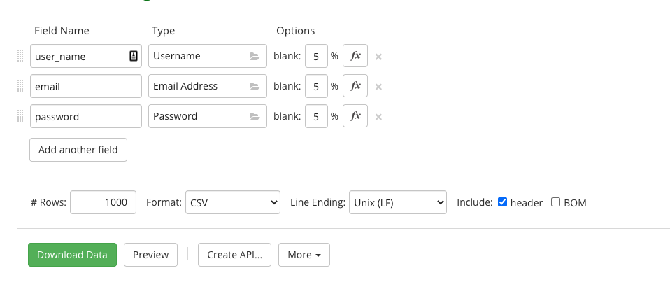
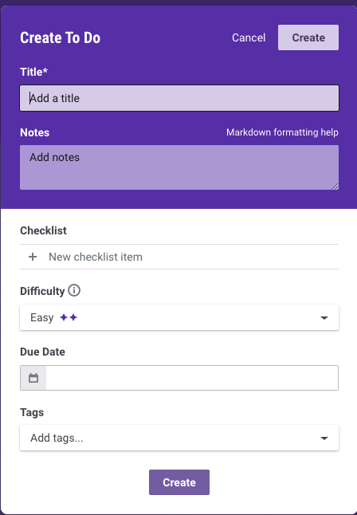

# Taller 7: Generación automática de datos con Mockaroo, Podam y Faker JS
### Introducción
Se hará una descripción de cada una de las herramientas y un demo de su funcionamiento el cuál será explicado en la wiki del repositorio.
En este caso será necesario:
1. Crear un demo de una API Rest para registro de cuentas nuevas con Mockaroo
2. Crear 3 distintos esquemas para posibles usos dentro de las aplicaciones Habitica y MyExpenses.
3. Generación de esquemas y datos automáticos para el uso en la aplicación móvil de Habitica con Podam.
4. Replicar los mismos esquemas creados con Mockaroo en la herramienta Facker.js.

### Aplicación

1. Partiendo de la base del taller 5, es necesario que se prueben los formularios de registro de la aplicación Habitica, haciendo uso de datos generados automáticamente por la aplicación Faker.js.

2. Mediante el uso de Podam se probarán las mismas funcionalidades en las aplicaciones móviles Habitica y MyExpenses. Se probara el login y registro de Habitica, y los input fields de MyExpenses.

### Solución
La solución del taller se puede encontrar en esta link de forma organizada: 

https://docs.google.com/document/d/1I5PqdPoc-RrhYmZhOUW_dnCDraG26U9knTdegJDDcaQ/edit?usp=sharing

Tambien fue incluida aca debajo.

#### Mockaroo
Mockaroo es un a plataforma que permite crear datos de prueba. La herramienta permite crear un API  a la cuál se pueden hacer requests reales que permitirán identificar problemas reales de la aplicación lo que permitirá mejorar la experiencia de usuario y la creación de la UI. 
Mockaroo permite mandar grandes cantidades de información con variedad en poco tiempo y simula las condiciones a las que la aplicación se enfrentaría en producción con cientos de usuarios haciendo uso de la aplicación y llenando la base de datos con información distinta. 
Tambien es posible hacer uso de herramientas no programáticas y descargar la información en formato SQL o CSV.

#### Generación de Schemas

Para crear los Schemas, es decir la plantilla con la que se crearan los datos.  

Esquema para registro de Habitica:  

Como se puede observar, la información se puede generar con campos vacíos basados en un porcentaje. Esto resulta útil al momento de probar formularios y sus verificaciones de campos vacíos.

Login Habitica:  

Esquema para creación de Todos:  
  
Basado en:  

#### Creación de API

Para la creación de la API Rest, una vez creados los esquemas dentro de la herramienta mockaroo es necesario dirigirse al esquema el cuál se desea utilizar y crear la API.  

Nota: Es importante que al momento de guardar el esquema se elija el formato en el cuál se desea que la API responda y cuantos datos debe generar.
Habitica_Todo
GET: 
https://my.api.mockaroo.com/habitica_todo.json?key=1dd1d190)
POST:  
https://my.api.mockaroo.com/habitica_todo.json?key=1dd1d190&__method=POST
GET (:id): 
https://my.api.mockaroo.com/habitica_todo/123.json?key=1dd1d190
Habitica_Register 
GET: 

GET (:id): 
Para simular de manera correcta la obtención de datos fue necesario agregar lo si quiente a mockaroo de manera que se devolviese el mismo usuario que se pidio aunque el resto de campos vuelven a hacer aleatorios.

Si intentamos obtener el usuario DanyAlej, obtenemos este mismo usuario:  
https://my.api.mockaroo.com/habitica_register/danyalej.json?key=1dd1d190  

POST:  
https://my.api.mockaroo.com/habitica_register.json?key=1dd1d190&__method=POST
Habitaca_Login:
GET: 
https://my.api.mockaroo.com/habitica_login.json?key=1dd1d190
POST: 
https://my.api.mockaroo.com/habitica_login.json?key=1dd1d190&__method=POST
GET (:email): 
https://my.api.mockaroo.com/habitica_login/dabenavides.json?key=1dd1d190

#### Interfaz

En este video se puede encontrar el funcionamiento de la interfaz:
https://www.loom.com/share/b6e1f560b6a6460fb270be0b64424e4c  
La interfaz interactúa con las diferentes APIs creadas, en este caso se presentan los 3 esquemas usados.
 
 

 
